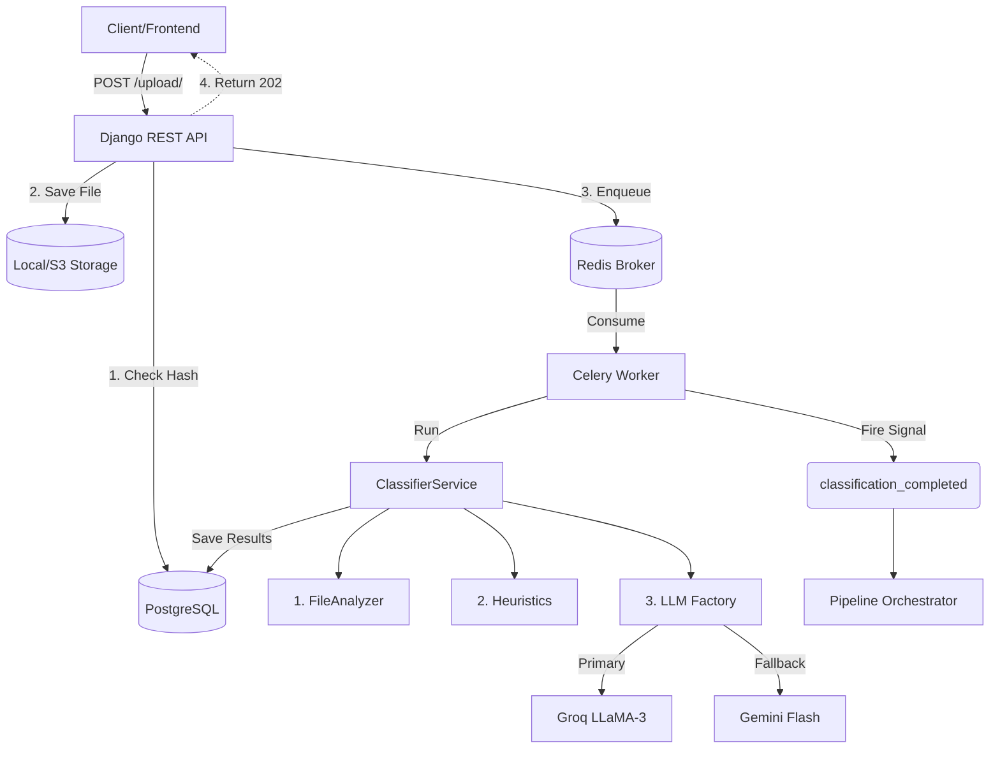

# Architecture & Flow: Construction AI Document Classification

This document outlines the high-level system architecture and the event-driven data flow of the Document Classification pipeline (Phase 1 of the Construction AI platform).

## System Architecture Overview

The system is designed as a decoupled, modular, and asynchronous pipeline. It is built to handle heavy documents (such as 100-page contracts or large architectural drawings) without blocking the main web server.

### Core Technologies
*   **Django / Django REST Framework (DRF)**: Serves as the primary web application and API layer.
*   **PostgreSQL**: The relational database used to store document metadata, audit logs, and LLM token usage.
*   **Redis**: The message broker used to queue background tasks.
*   **Celery (with Eventlet)**: The background worker system responsible for executing the heavy classification tasks asynchronously.
*   **Groq / Gemini (via LangChain)**: The LLM inference layer used for parsing and structured data extraction.

---

## The Request Data Flow

When a user or external service uploads a document, it triggers the following exact sequence of events:

### 1. Ingestion (`DocumentUploadSerializer`)
*   **Upload**: The client sends a `multipart/form-data` POST request containing the file to the `/api/documents/upload/` endpoint.
*   **Deduplication (SHA-256)**: The system immediately reads the file in binary and calculates its SHA-256 hash. It checks the `DocumentFingerprint` table.
    *   *If the hash exists:* It returns the existing document record (Status 200) and halts further processing.
    *   *If the hash is new:* It proceeds to save the file.
*   **Storage**: The file is assigned a unique UUID prefix and saved via the `local_storage` abstraction.
*   **Database Record**: A new `Document` record is created in PostgreSQL with `status='queued'`.
*   **Asynchronous Handoff**: The API triggers `classify_document_task.delay(doc_id)`, pushing the job to Redis, and immediately returns a `202 Accepted` response to the user.

### 2. Background Processing (`classify_document_task`)
*   **Worker Pickup**: A Celery worker picks up the task from Redis and changes the document status to `classifying`.
*   **Service Invocation**: The task invokes `ClassifierService.process_document(doc)`, passing the Django model instance.
*   **Classification**: The service runs the file through the 3-Layer Classification Engine (File Analysis -> Heuristics -> LLM).
*   **Database Update**: The extracted metadata (`doc_type`, `confidence`, `has_images`, `has_tables`, etc.) is saved to the `Document` model.

### 3. Event-Driven Downstream Orchestration
To prevent hard-coupling components, the system utilizes **Django Signals**.

*   **Success**: If the classification succeeds, Celery fires the `classification_completed` signal. The `OrchestratorService` listens to this signal and decides the next step (e.g., triggering the OCR pipeline or chunking engine).
*   **Failure/Retry**: If the classification fails (e.g., due to an LLM hallucination or a rate limit), the task catches the exception and initiates an **exponential backoff retry** (e.g., retrying in 60s, then 120s, up to 3 times).
*   **Human-in-the-Loop**: If the LLM confidence is below `0.75`, the status is set to `needs_review`, pushing it to a separate Human Review Queue.

---

## Architecture Diagram (Mental Model)

