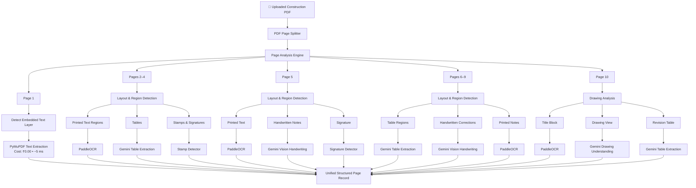

# 🚀 Future Enhancement: Fine-Grained Region-Based Multi-Engine OCR Pipeline

## 📌 Executive Summary & Motivation
In complex construction documents (BOQs, site inspection logs, structural drawings, FIDIC contracts), **a single page often contains multiple visual elements simultaneously**:

1. Printed text specifications
2. Tabular BOQ pricing rows
3. Handwritten site annotations / engineer corrections
4. Official wet stamps & signatures
5. CAD drawing views & title blocks

### The Problem with Page-Level OCR
A page-level OCR router assigns the **entire page** to a single extraction strategy (e.g. sending the whole page to a table extractor). As a result:
- Handwritten margin notes on a BOQ page get lost or corrupted.
- Official approval stamps next to a CAD drawing are omitted.

---

## 🏗️ Production-Grade Architecture: Region-Based Layout Detection

The upgraded pipeline performs **Layout & Region Detection** per page, bounding regions into bounding boxes (bboxes), and routing each region independently to its specialized engine before merging into a unified page record.

---

## 🛠️ Step-by-Step Implementation Roadmap

### Phase 1: Layout Detection Model Integration (`LayoutLMv3` / `YOLOv8-Layout`)
- Implement `LayoutDetector` inside `document_processing/services/layout/`.
- Segment page image into bounding box coordinates (`x_min, y_min, x_max, y_max`) tagged as:
  - `TEXT_REGION`
  - `TABLE_REGION`
  - `HANDWRITING_REGION`
  - `STAMP_REGION`
  - `SIGNATURE_REGION`
  - `TITLE_BLOCK_REGION`

### Phase 2: Region-Level Task Routing
- Update `process_page_task` in `document_processing/tasks/process_page.py` to iterate over bounding box crops.
- Send `TEXT_REGION` crops to PaddleOCR / PyMuPDF.
- Send `TABLE_REGION` crops to `GeminiVisionService` (`TABLE_EXTRACTION_PROMPT`).
- Send `HANDWRITING_REGION` crops to `GeminiVisionService` (`HANDWRITING_EXTRACTION_PROMPT`).
- Send `STAMP_REGION` crops to Stamp Classifier.

### Phase 3: Spatial Document Re-Assembly
- Assemble extracted region text and JSON objects into `UnifiedStructuredPageRecord`.
- Order elements top-to-bottom, left-to-right based on bounding box coordinates (`y_min`, `x_min`).

---

## 📑 Target Files to Update During Implementation

1. `document_processing/services/layout/layout_detector.py` *(New File)*
2. `document_processing/services/routing/ocr_router.py`
3. `document_processing/tasks/process_page.py`
4. `document_processing/schemas/page_analysis.py`
5. `document_processing/services/parsing/content_cleaner.py`
