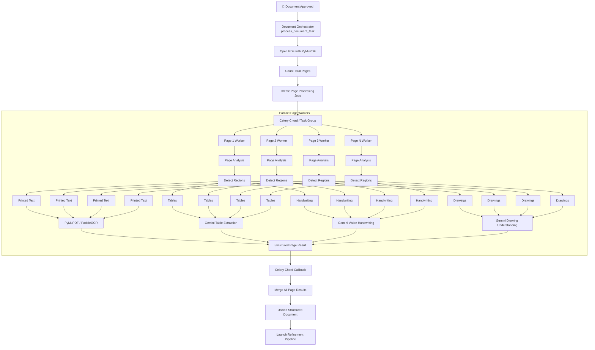

# ⚡ Future Enhancement: Parallel Fan-Out/Fan-In Celery Chord Orchestration & Large PDF Chunking

## 📌 Executive Summary & Key Solved Issues

This enhancement addresses four critical scaling challenges when processing massive engineering PDFs (e.g., 500-page specification books or multi-sheet construction drawing sets):

1. **Large PDF Efficiency**: Avoids worker overload on 500+ page PDFs by chunking page batches into dynamic Celery sub-groups.
2. **Multi-Region Page Extraction**: Eliminates single-engine page assumptions; allows a single page worker to process printed text, tables, handwriting, and drawings simultaneously.
3. **Deterministic Fan-In Aggregation**: Uses Celery Chord callbacks to ensure 100% of parallel page tasks finish before merging.
4. **Clean Separation of Concerns**: Isolates Document Orchestration (`process_document_task`) from Page Region Processing (`process_page_task`).

---

## 🏗️ Production-Grade Flowchart Architecture

---

## 🛠️ Step-by-Step Technical Implementation Roadmap

### 1. Dynamic Page Batching for 100+ Page PDFs
- Update `process_document_task` in `document_processing/tasks/process_document.py`.
- If `total_pages > 50`, group page numbers into batches of 10 pages per Celery worker to prevent Redis task queue flooding.

### 2. Multi-Region Concurrent Dispatch per Worker
- Inside `process_page_task` ([process_page.py](file:///c:/Users/Ashish%20jaiswal/Downloads/generative%20ai/accuracy_construction_Rg/document_processing/tasks/process_page.py#L95-L210)):
  - Run region detection.
  - Dispatch region tasks for `Printed Text` (PaddleOCR/PyMuPDF), `Tables` (Gemini Table), `Handwriting` (Gemini HW), and `Drawings` (Gemini DWG) within the same page context.

### 3. Celery Chord Fan-In Callback (`aggregate_results_task`)
- Use `celery.chord(page_tasks)(aggregate_results_task.s(job_id))` ([process_document.py:L66](file:///c:/Users/Ashish%20jaiswal/Downloads/generative%20ai/accuracy_construction_Rg/document_processing/tasks/process_document.py#L66)).
- When all page results arrive at `aggregate_results_task`:
  1. Merge page elements into `Unified Structured Document`.
  2. Write strategy breakdown metadata to `ProcessingJob.processing_meta`.
  3. Atomically trigger `refine_page_task` for downstream Phase 3 processing.

---

## 📑 Target Files for Future Updates

1. `document_processing/tasks/process_document.py`
2. `document_processing/tasks/process_page.py`
3. `document_processing/tasks/aggregate_results.py`
4. `future_enhancement_docs/parallel_fanout_orchestration.md`
